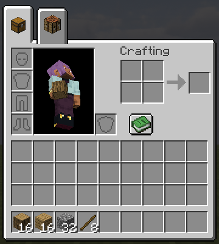
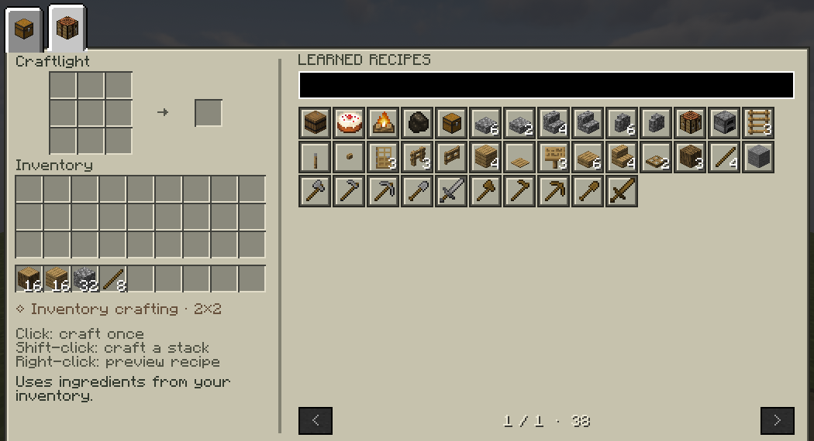

A crafting browser in your inventory. Open your inventory with **E** and click the **crafting-table tab**
above it: every recipe you've learned, in a searchable grid, crafted with a click. The chest tab takes
you back to your normal inventory.

## Using it

- **Search** by item name, recipe id or recipe type. Recipes you unlock while it's open appear at once.
- **Click** a recipe to craft it once.
- **Shift-click** to craft up to a full stack with what you have.
- **Right-click** to preview its ingredients and result.
- Scroll or use the arrows to change pages. Hover over a recipe for its details.

## The rules

- It crafts from **your inventory**, as the recipe book does. It doesn't craft the ingredients for you
  or take from nearby chests.
- Recipes that fit the 2×2 grid work anywhere. **Bigger ones need a crafting table within reach.**
  (Move to a different table? Switch tabs and back.)
- Smelting, stonecutting and other station recipes can be looked at, but they're made at their station
  as usual.
- The whole result has to fit in your inventory before it crafts. Buckets and other containers come
  back as usual.
- In creative, the inventory is the normal creative one.
